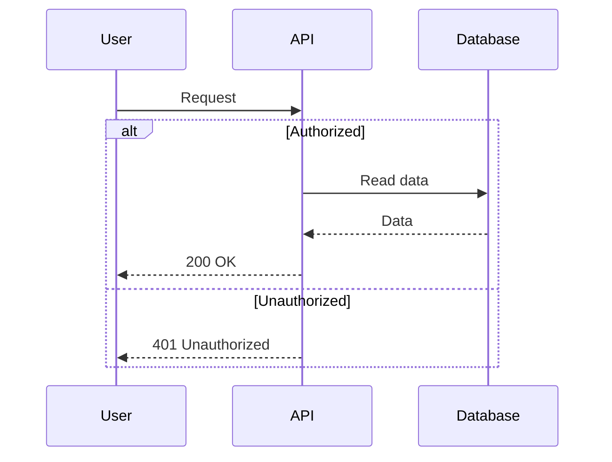
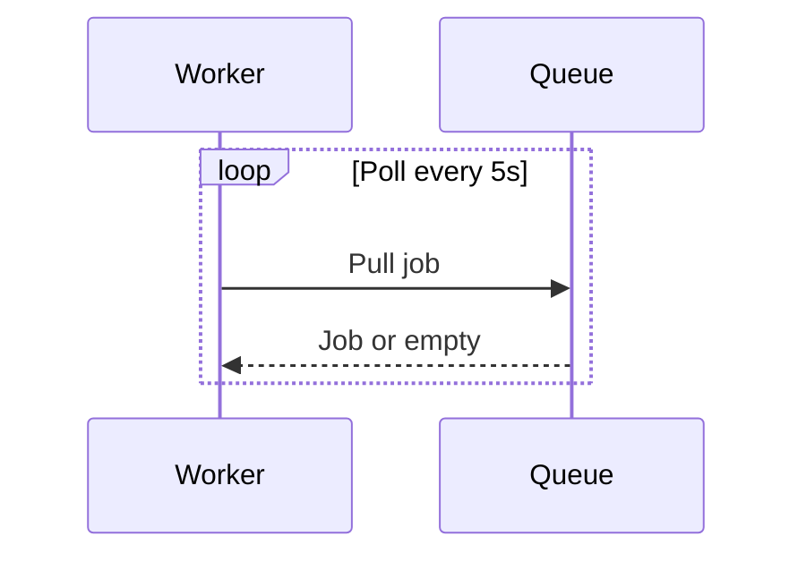
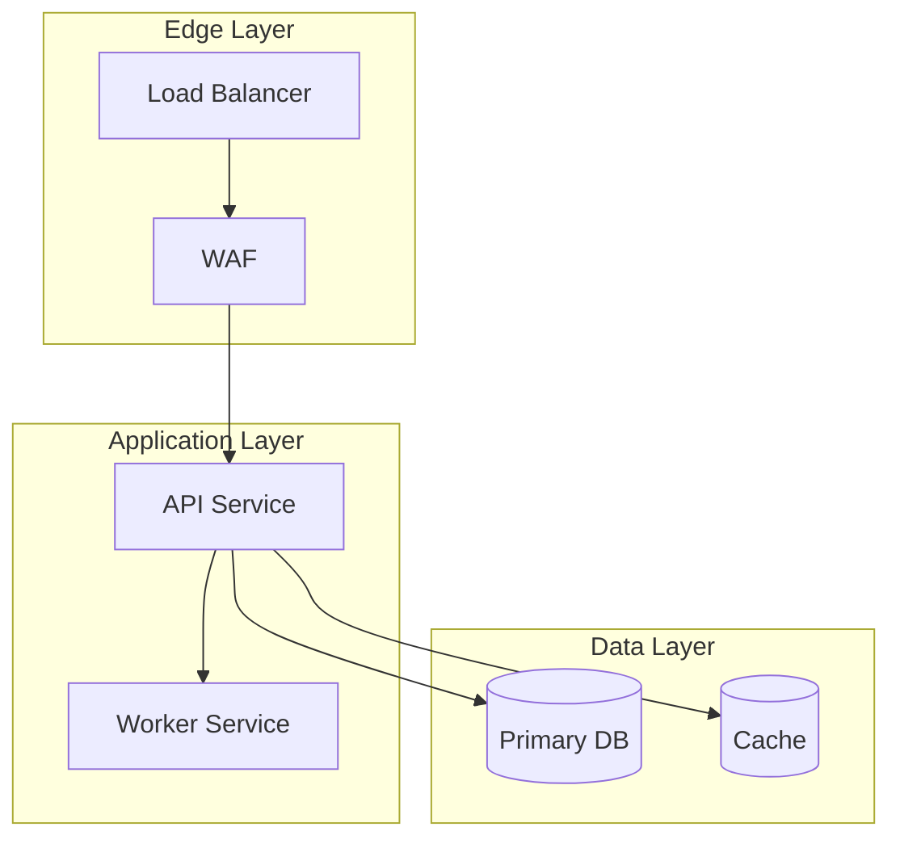

# Advanced Mermaid Patterns

Use these patterns when basic templates are insufficient and validation still passes.

## Sequence Conditionals (`alt` / `else`)

## Sequence Loops

## Complex Subgraphs

## Error-Resilient Authoring Notes

- Add one advanced construct at a time before validation.
- Validate after each structural edit, not only at the end.
- If advanced syntax fails repeatedly, downgrade to simpler constructs and preserve meaning.
