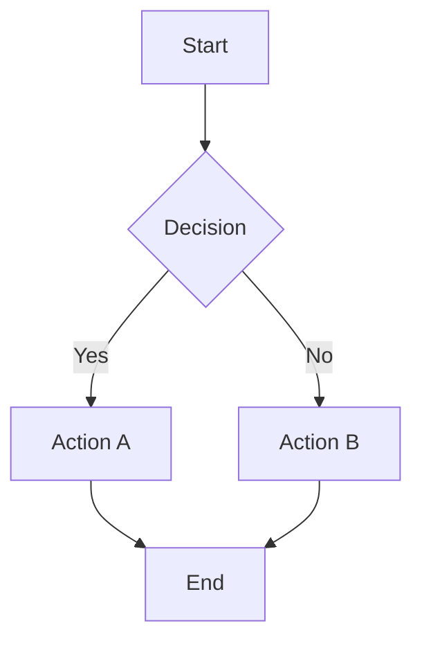
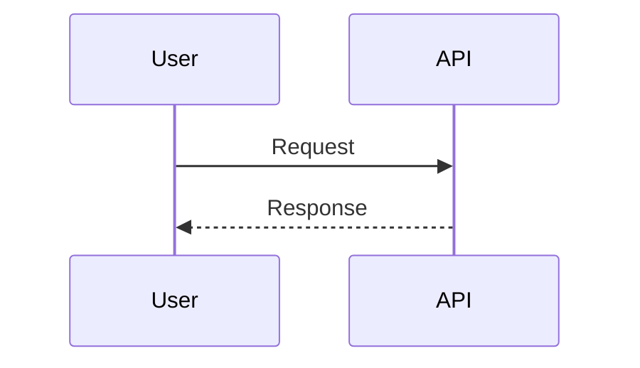
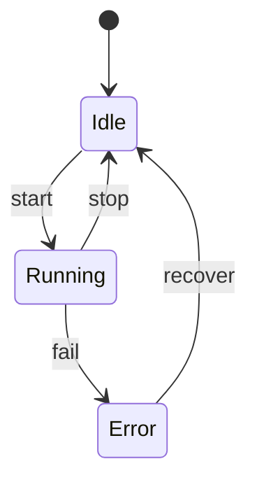

# Mermaid Best Practices

## Diagram Selection

- Use `flowchart` for process flow, architecture overviews, and decision paths.
- Use `sequenceDiagram` for time-ordered interactions between components.
- Use `stateDiagram-v2` for lifecycle and transition modeling.
- Prefer the smallest diagram type that communicates the core intent.

## Markdown Fence Rules

- Opening fence must be exactly ` ```mermaid`.
- Closing fence must be exactly ` ``` `.
- Place both fences at column 0.
- Do not nest markdown fences inside Mermaid blocks.
- Keep one Mermaid diagram per fence.

## Flowchart Guidance

- Use `TD` for hierarchical flows and `LR` for linear flows.
- Keep node labels concise and consistent.
- Use subgraphs to group related regions.
- Prefer explicit labels on decision edges (`|Yes|`, `|No|`).

## Sequence Diagram Guidance

- Order participants left-to-right by interaction flow.
- Use meaningful aliases for long participant names.
- Use notes for clarifying intent rather than overloading message text.
- Use `autonumber` when step references are useful.

## Styling and Visual Clarity

- Keep a consistent color palette across related diagrams.
- Use contrast-safe colors and do not encode meaning with color alone.
- Avoid dense node graphs that require zoom to read.
- Prefer splitting one large diagram into several focused diagrams.

## Accessibility Baseline

- Target text/background contrast ratios of at least 4.5:1 for regular text.
- Use both color and structure to encode meaning (shape, labels, edge text).
- Prefer short, explicit labels over dense abbreviations.
- Keep node text readable at normal documentation zoom levels.

## Accessible Palette Example

Use this as a default palette when no project palette is provided:

- Primary text/stroke: `#1f2937`
- Neutral fill: `#f3f4f6`
- Informational fill: `#dbeafe` with stroke `#1d4ed8`
- Success fill: `#dcfce7` with stroke `#15803d`
- Warning fill: `#fef3c7` with stroke `#b45309`
- Error fill: `#fee2e2` with stroke `#b91c1c`

## Color-Blind-Safe Cues

- Do not rely on red/green alone for pass/fail semantics.
- Add textual qualifiers on edges (`|Success|`, `|Failure|`).
- Use consistent shape differences for critical states:
  - Decision: diamond
  - Terminal: rounded/explicit end node
  - Error path: labeled edge plus distinctive node text

## Common Syntax Hygiene

- Close all brackets, braces, and parentheses.
- Keep arrow syntax valid for diagram type (`-->`, `->>`, `-->>`).
- Quote labels that include special characters.
- Use consistent indentation to improve maintainability.

## Quick Templates






